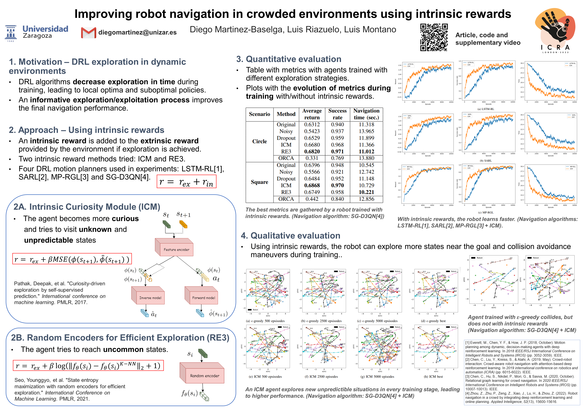
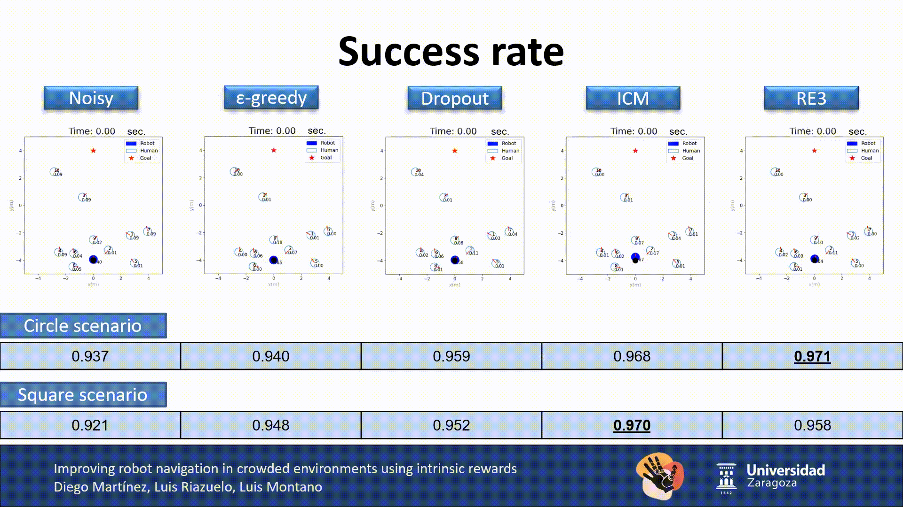
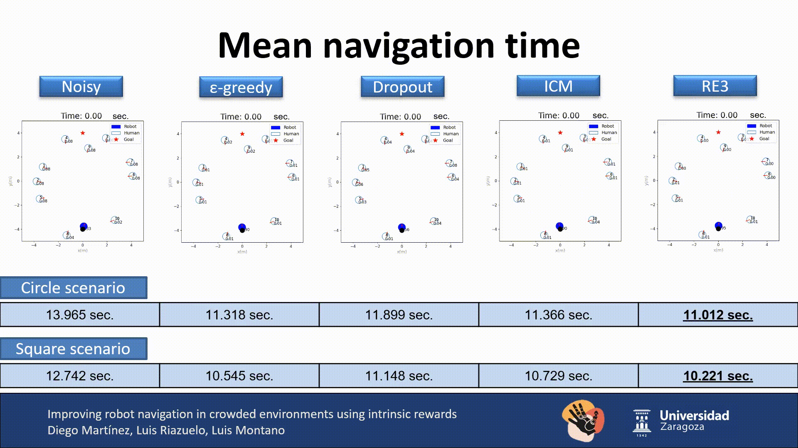
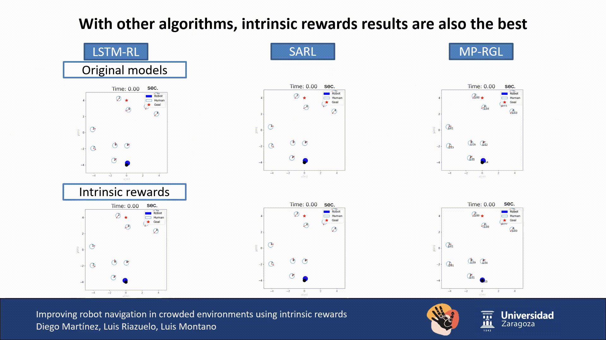

# Improving robot navigation in crowded environments using intrinsic rewards (ICRA 2023)

# [Paper](https://arxiv.org/abs/2302.06554) || [Video](https://youtu.be/Ksbok2YM9YY)

## Poster


## Abstract
Autonomous navigation in crowded environments is an open problem with many applications, essential for the coexistence of robots and humans in the smart cities of the future. In recent years, deep reinforcement learning approaches have proven to outperform model-based algorithms. Nevertheless, even though the results provided are promising, the works are not able to take advantage of the capabilities that their models offer. They usually get trapped in local optima in the training process, that prevent them from learning the optimal policy. They are not able to visit and interact with every possible state appropriately, such as with the states near the goal or near the dynamic obstacles. In this work, we propose using intrinsic rewards to balance between exploration and exploitation and explore depending on the uncertainty of the states instead of on the time the agent has been trained, encouraging the agent to get more curious about unknown states. We explain the benefits of the approach and compare it with other exploration algorithms that may be used for crowd navigation. Many simulation experiments are performed modifying several algorithms of the state-of-the-art, showing that the use of intrinsic rewards makes the robot learn faster and reach higher rewards and success rates (fewer collisions) in shorter navigation times, outperforming the state-of-the-art.

## Setup
1. Install [Python-RVO2](https://github.com/sybrenstuvel/Python-RVO2) library
2. Install [socialforce](https://github.com/ChanganVR/socialforce) library
2. Install crowd_sim and crowd_nav into pip
```
pip install -e .
```

## Getting Started
This repository are organized in two parts: crowd_sim/ folder contains the simulation environment and crowd_nav/ folder contains codes for training and testing the policies. Details of the simulation framework can be found [here](crowd_sim/README.md). Below are the instructions for training and testing policies, and they should be executed
inside the crowd_nav/ folder.

1. Train a policy.
```
	python train.py --policy tree-search-rl --output_dir data/tsrl_random_encoder/ --config configs/icra_benchmark/ts_separate_random_encoder.py
```
2. Test policies with 1000 test cases.
```
python test.py --model_dir data/tsrl_random_encoder/
```
3. Run policy for one episode and visualize the result.
```
python test.py --policy tree-search-rl --model_dir data/tsrl_random_encoder/ --phase test --visualize --test_case 0
```
Note that in **run_experiments_icra.sh**, some examples of how to train different policies with several exploration algorithms. In **configs/icra_benchmark/**, all the configurations used for testing are shown.

## Improving SG-D3QN




## Improving other models




## Acknowledge
This work is based on [CrowdNav](https://github.com/vita-epfl/CrowdNav) and [RelationalGraphLearning](https://github.com/ChanganVR/RelationalGraphLearning) and [SG-D3QN](https://github.com/nubot-nudt/SG-D3QN).  The authors are thankful for their works and for making them available.

## Citation
If you use this work in your own research or wish to refer to the paper's results, please use the following BibTeX entries.
```bibtex
@inproceedings{martinez2023improving,
  author       = {Martinez-Baselga, Diego and Riazuelo, Luis and Montano, Luis},
  title        = {Improving robot navigation in crowded environments using intrinsic rewards},
  year         = {2023},
  booktitle    = {{IEEE International Conference on Robotics and Automation (ICRA)}},
  url          = {https://arxiv.org/abs/2302.06554}
}

